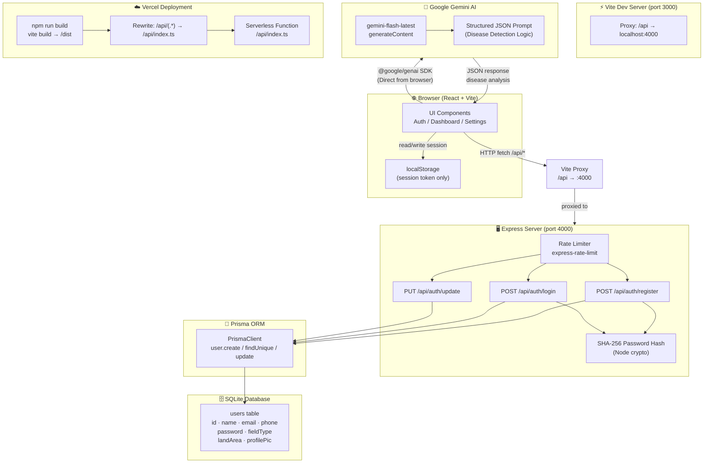
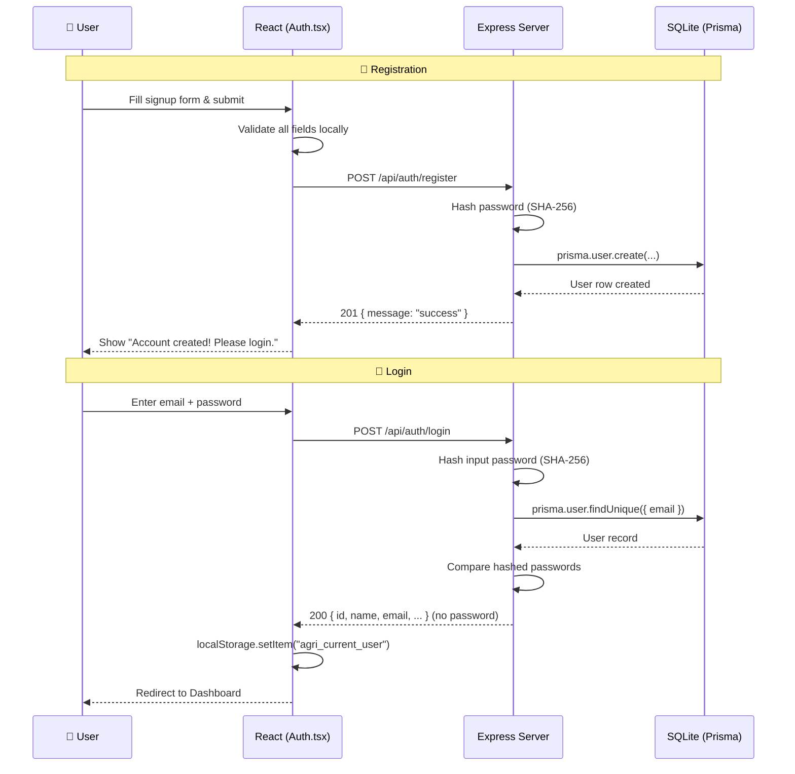
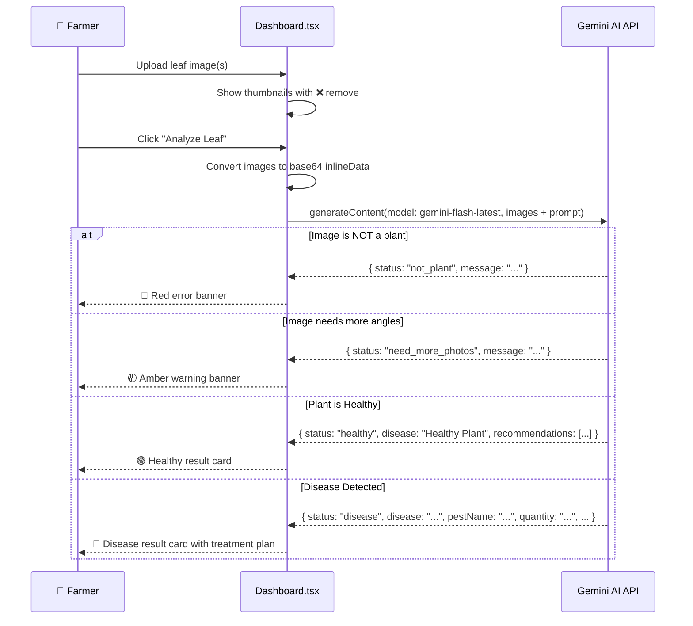
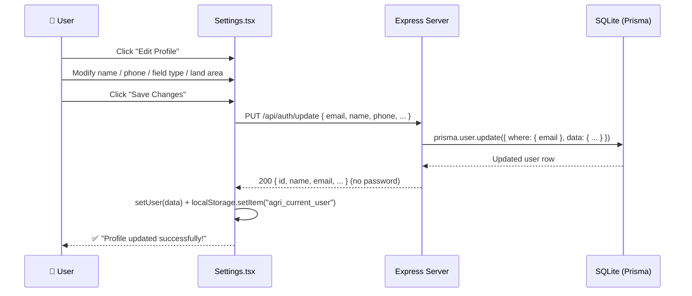
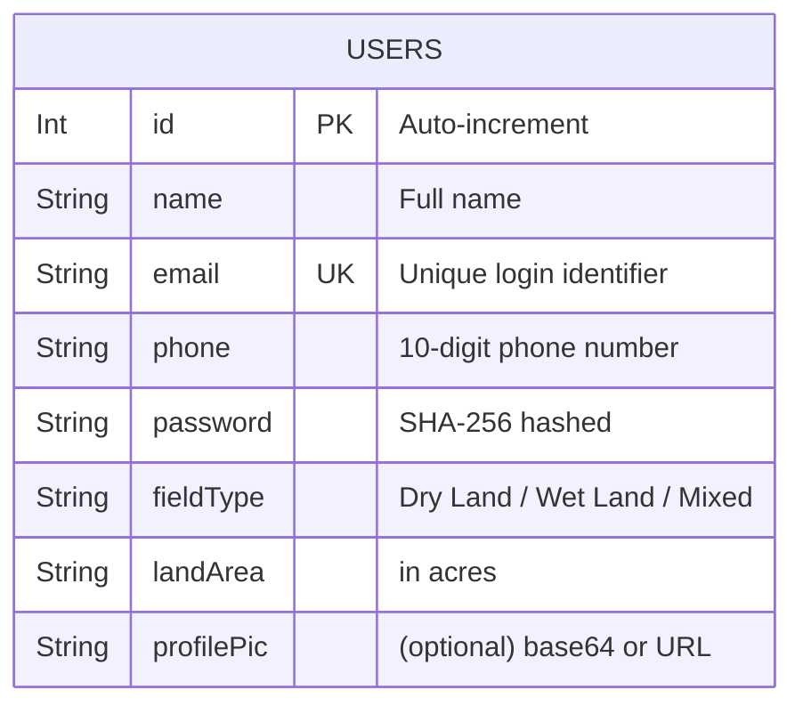

# AgriAdvisor — System Architecture

## Overview

AgriAdvisor is a full-stack agricultural advisory web app built with **React + TypeScript + Vite** on the frontend, **Express.js** as the backend API layer, **Prisma ORM** with a local **SQLite** database for persistence, and the **Google Gemini AI API** for plant disease detection.

---

## High-Level Architecture

---

## Authentication Flow

---

## Plant Disease Detection Flow

---

## Settings / Profile Update Flow

---

## Database Schema

---

## Tech Stack Summary

| Layer | Technology |
|-------|-----------|
| **Frontend Framework** | React 19 + TypeScript |
| **Build Tool** | Vite 6 |
| **Styling** | Tailwind CSS v4 |
| **Animations** | motion/react |
| **Icons** | lucide-react |
| **AI** | Google Gemini (`gemini-flash-latest`) |
| **Backend** | Express.js |
| **ORM** | Prisma |
| **Database** | SQLite (`agriadvisor.db`) |
| **Password Hashing** | Node.js `crypto` SHA-256 |
| **Rate Limiting** | express-rate-limit |
| **Dev Runner** | concurrently + tsx |
| **Deployment** | Vercel (Serverless Functions) |
| **Multilingual** | English · Hindi · Telugu · Tamil |
